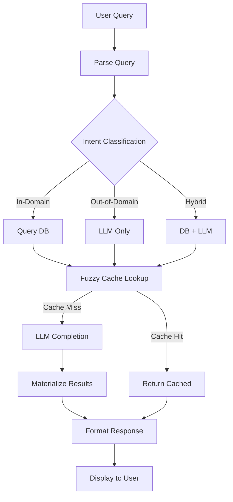

# 🏋️‍♂️ Personalized Fitness and Sports Coach

> AI-powered Hybrid Fitness, Exercise & Nutrition Recommendation Engine

An intelligent fitness + sports coaching system that combines structured databases with LLM reasoning to provide personalized workout plans, nutrition recommendations, and sports equipment suggestions.

## 🌟 Overview

This project implements a smart fitness coaching system that seamlessly blends:

- **Structured Databases** (Exercise FDW + Nutrition FDW)
- **LLM Reasoning** (Groq LLaMA Models)
- **Hybrid Recommendations**
- **Materialization Cache** with fuzzy matching for faster repeated queries

Built as an interactive CLI application that interprets natural language queries and returns structured, actionable plans.

---

## 🚀 Features

### ✅ 1. Hybrid AI + Database Recommendation System

The system intelligently classifies queries into three categories:

| Query | Classification | Response Type |
|-------|---------------|---------------|
| "Give me a workout plan for chest" | **In-domain** | Exercises from DB + LLM plan |
| "Which bike should I buy under $2000?" | **Out-of-domain** | Pure LLM item list |
| "Give me 3 high-protein foods and an arm workout" | **Hybrid** | DB + LLM combined |

### ✅ 2. Fuzzy Cache for LLM Results

Avoids redundant API calls by caching similar queries:

```
Query 1: "5 shoes under 10000 rupees"
Query 2: "Suggest shoes under 10k"
→ Similarity ≥ 0.85 → Cache Hit ✔
```

### ✅ 3. Structured Fitness + Food Query Parsing

Intelligent extraction of:
- Target muscle groups
- Protein/macro filters
- Workout duration (#days)
- Dietary preferences (low-carb, gluten-free)
- Numeric constraints
- Unmatched tokens → triggers LLM reasoning

### ✅ 4. Clean JSON Output

Every response includes:
- Structured database data
- LLM-completed plan
- Metadata (score, confidence, cache ID)
- Human-readable summary

### ✅ 5. Materialized Recommendation Table (Data Warehouse)

All LLM responses stored in `trainer_dw.materialized_recommendations`:
- Structured rows
- Parsed intents
- LLM output JSON
- Score & confidence metrics

Enables retrieval, analysis, and intelligent caching.

---

## 🗂 Project Structure

```
📦 Personalized-Fitness-and-Sports-Coach
│
├── 📄 FINAL_CODE.py                  # Main hybrid pipeline
├── 📄 final_demo.py                  # Demo interface
├── 📄 llm_integration.py             # LLM testing utilities
├── 📄 trainer_llm.py                 # Additional LLM tools
│
├── 📊 exercises_final.csv            # Cleaned exercise database
├── 📊 nutrition_cleaned_final1.csv   # Cleaned nutrition database
│
├── 📝 .gitignore
├── 📝 .gitattributes
└── 📝 README.md
```

---

## ⚙️ Installation & Setup

### 1️⃣ Clone the Repository

```bash
git clone https://github.com/Asmit-Sethy/Personalized-Fitness-and-Sports-Coach.git
cd Personalized-Fitness-and-Sports-Coach
```

### 2️⃣ Create a Virtual Environment

```bash
# Linux/Mac
python -m venv venv
source venv/bin/activate

# Windows
python -m venv venv
venv\Scripts\activate
```

### 3️⃣ Install Dependencies

```bash
pip install -r requirements.txt
```

### 4️⃣ Configure Environment Variables

Create a `.env` file in the project root:

```env
# Database Configuration
DB_HOST=localhost
DB_PORT=5432
DB_NAME=trainer_dw
DB_USER=postgres
DB_PASS=your_password

# API Keys
GROQ_API_KEY=your_groq_api_key_here
```

### 5️⃣ Set Up Database

Ensure PostgreSQL is running and create the required database:

```sql
CREATE DATABASE trainer_dw;
```

---

## ▶️ Running the System

Start the hybrid fitness assistant:

```bash
python FINAL_CODE.py
```

### Example Interaction

```
Enter your question: give me a 2-day workout for arms and high-protein foods

🎯 Processing your request...
✅ Found exercises for: arms
✅ Found nutrition data matching: high-protein
🧠 Generating personalized plan...

📋 Your Personalized Plan:
...
```

---

## 🧠 How the Pipeline Works



### Pipeline Steps

1. **Parse Query** - Extracts intent (muscles, filters, needs_exercise, needs_nutrition, unmatched tokens)
2. **Run Database Queries** - Queries Exercise FDW and Nutrition FDW
3. **Determine Mode** - Classifies as IN-DOMAIN, OUT-OF-DOMAIN, or HYBRID
4. **Fuzzy Cache Lookup** - Checks for similar previous queries
5. **LLM Completion** - Generates response with strict JSON enforcement
6. **Materialize Results** - Saves to data warehouse for future retrieval
7. **Human-friendly Output** - Formats and displays recommendation

---

## 📊 Example Outputs

### Hybrid Query

**Input:** `"Give me a 2-day workout for shoulders and low-fat foods"`

**Output:** Structured DB rows + LLM-generated workout plan with meal suggestions

### Out-of-Domain Query

**Input:** `"give 5 bike names under 2000 dollars"`

**Output:**
```json
{
  "items": [
    {"name": "Giant Escape 3", "price": "$550", "type": "Hybrid"},
    {"name": "Trek FX 1", "price": "$600", "type": "Fitness"},
    {"name": "Schwinn Discover", "price": "$480", "type": "Hybrid"},
    {"name": "Diamondback Insight", "price": "$650", "type": "Performance"},
    {"name": "Raleigh Cadent", "price": "$700", "type": "Urban"}
  ]
}
```

### In-Domain Query

**Input:** `"chest exercises for beginners"`

**Output:** Curated list from exercise database with beginner-friendly movements

---

## 🛠 Tech Stack

- **Python 3.10+** - Core programming language
- **PostgreSQL + FDW** - Structured data storage with Foreign Data Wrappers
- **Groq LLaMA-3.1 API** - Large language model inference
- **Pandas** - Data manipulation and analysis
- **Difflib** - Fuzzy string matching for cache
- **Dataclasses** - Structured data modeling
- **JSON** - Materialization and response format

---

## 🔮 Future Enhancements

- [ ] **Web UI** (Streamlit/Gradio)
- [ ] **REST API** (FastAPI)
- [ ] **Vector Embeddings** for semantic caching
- [ ] **User Authentication** & usage analytics
- [ ] **GPU-based Model** fine-tuning
- [ ] **Mobile App** integration
- [ ] **Multi-language** support
- [ ] **Voice Input** capability

---

## 🤝 Contributing

Contributions are welcome! Here's how you can help:

1. Fork the repository
2. Create a feature branch (`git checkout -b feature/AmazingFeature`)
3. Commit your changes (`git commit -m 'Add some AmazingFeature'`)
4. Push to the branch (`git push origin feature/AmazingFeature`)
5. Open a Pull Request

Please open an issue first to discuss proposed changes.

---

## 📄 License

This project is licensed under the MIT License - see the [LICENSE](LICENSE) file for details.
MIT License

Copyright (c) 2024 Asmit Sethy

Permission is hereby granted, free of charge, to any person obtaining a copy
of this software and associated documentation files (the "Software"), to deal
in the Software without restriction, including without limitation the rights
to use, copy, modify, merge, publish, distribute, sublicense, and/or sell
copies of the Software, and to permit persons to whom the Software is
furnished to do so, subject to the following conditions:

The above copyright notice and this permission notice shall be included in all
copies or substantial portions of the Software.

THE SOFTWARE IS PROVIDED "AS IS", WITHOUT WARRANTY OF ANY KIND, EXPRESS OR
IMPLIED, INCLUDING BUT NOT LIMITED TO THE WARRANTIES OF MERCHANTABILITY,
FITNESS FOR A PARTICULAR PURPOSE AND NONINFRINGEMENT. IN NO EVENT SHALL THE
AUTHORS OR COPYRIGHT HOLDERS BE LIABLE FOR ANY CLAIM, DAMAGES OR OTHER
LIABILITY, WHETHER IN AN ACTION OF CONTRACT, TORT OR OTHERWISE, ARISING FROM,
OUT OF OR IN CONNECTION WITH THE SOFTWARE OR THE USE OR OTHER DEALINGS IN THE
SOFTWARE.

---
